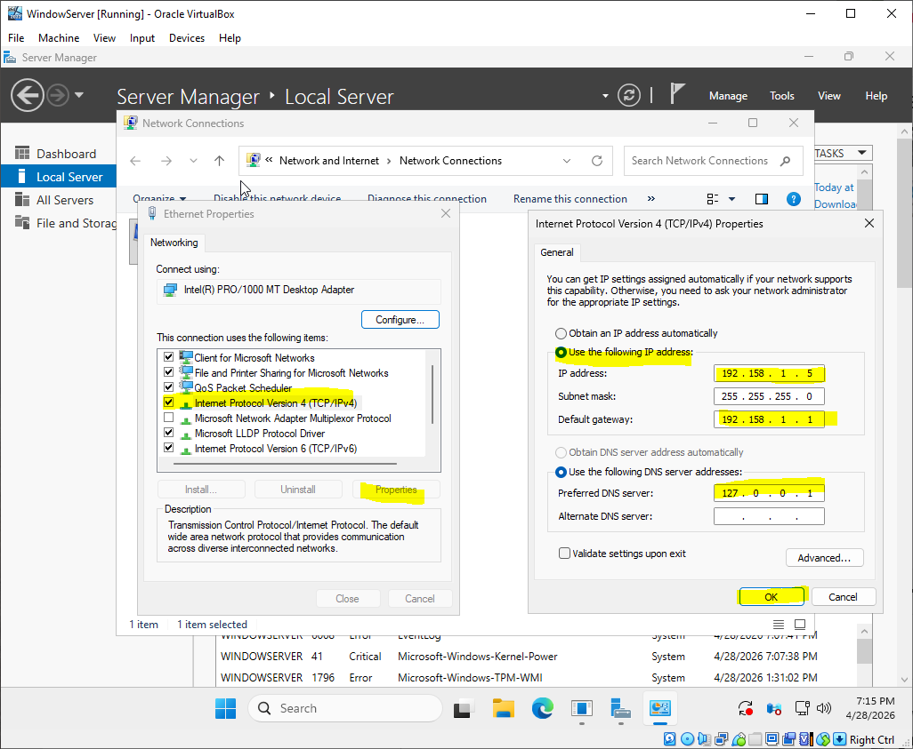
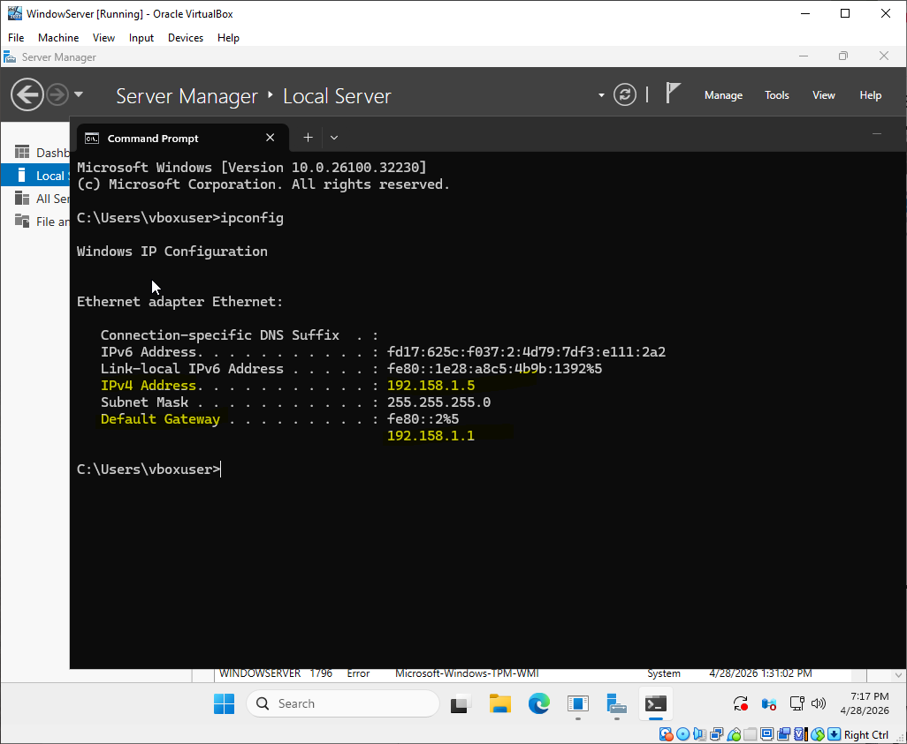

# Windows Server 2025 IP Configuration Lab

## Objective
The purpose of this lab was to configure a static IP address on a Windows Server 2025 virtual machine and verify network connectivity. This setup is essential for servers acting as domain controllers or providing network services.

---

## Tools Used
- Windows Server 2025
- VirtualBox
- Command Prompt
- Network Adapter Settings

---

## Lab Environment
- Virtual Machine: Windows Server 2025

---

## Steps Performed

### 1. Open Network Adapter Settings

- Open `Server Manager` using taskbar search
- Open `Local Server`
- Press the hyperlinked Ethernet
- In Network Connection window Right-click **Ethernet** → Select **Properties**
  
---

### 2. Configure IPv4 Settings
- In Ethernet Properties left-click **Internet Protocol Version 4 TCP/IPv4** → Select **Properties**
- In Internet Protocol Version 4 → Select **use the following IP address:**
- Insert IP address, Default Gateway. In this example I created a IP & gateway.
- Select **Use the following DNS server addresses:** → Insert Perferred DNS Server:
- Finish by selecting **OK**

### 3. Verify IP Configuration

- Open Command Prompt and run: ipconfig
-Confirmed: Correct IPv4 address, Subnet mask, Default gateway

---

### 4. Test Network Connectivity

Run the following commands:

ping 192.158.1.5
ping google.com

Purpose:
- Verify internet connectivity
- Confirm DNS resolution is working

---

## Screenshots

Add your screenshots here:

- IP configuration settings
- `ipconfig` output
- Successful ping results

Example:

---

## Key Concepts Learned

- Difference between static and dynamic IP addressing
- Importance of DNS in network communication
- Role of default gateway
- How to verify connectivity using command-line tools

---

## Common Issues & Troubleshooting

### No Internet Access
- Verify default gateway is correct
- Check IP address is within correct network range

### DNS Not Working
- Test with `ping 8.8.8.8`
- If successful, issue is DNS-related
- Update DNS server settings

### IP Conflict
- Ensure no duplicate IP addresses on the network

---

## Real-World Relevance

Configuring static IP addresses is critical in real-world environments for:

- Domain Controllers
- Servers hosting services (DNS, DHCP, Web)
- Network stability and predictability
- Troubleshooting connectivity issues

---

## What I Learned

Through this lab, I learned how to manually configure network settings on a Windows Server, verify connectivity, and troubleshoot common network issues. This is a fundamental skill used in IT support, system administration, and cybersecurity roles.
